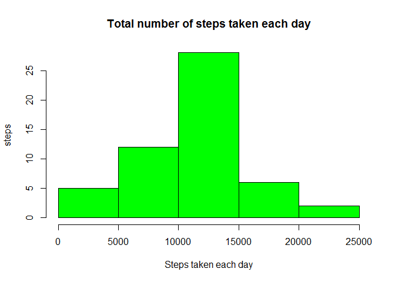
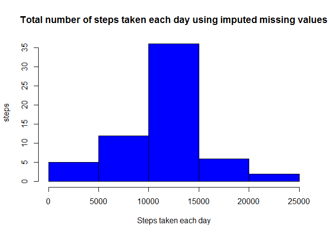
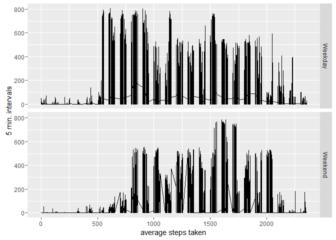

# Reproducible Research Porject 1
GregE  
July 1, 2016  

This is an R Markdown document containing the full submission for the first project in the Johns Hopkins Reproducible Research course. 

Markdown is a simple formatting syntax for authoring HTML, PDF, and MS Word documents. For more details on using R Markdown see <http://rmarkdown.rstudio.com>.

There are 9 steps to this particular research project (not counting the submisstion).

Steps and results:

1 The code for reading in the dataset and/or processing the data.


```r
activity <- unzip("repdata_data_activity.zip")
acts <- read.csv(activity)
acts$date <- as.Date(acts$date)
# write.csv(acts,"acts.csv")
summary(acts)
```

```
##      steps             date               interval     
##  Min.   :  0.00   Min.   :2012-10-01   Min.   :   0.0  
##  1st Qu.:  0.00   1st Qu.:2012-10-16   1st Qu.: 588.8  
##  Median :  0.00   Median :2012-10-31   Median :1177.5  
##  Mean   : 37.38   Mean   :2012-10-31   Mean   :1177.5  
##  3rd Qu.: 12.00   3rd Qu.:2012-11-15   3rd Qu.:1766.2  
##  Max.   :806.00   Max.   :2012-11-30   Max.   :2355.0  
##  NA's   :2304
```

2 Histogram of the total number of steps taken each day.


```r
daysteps <- aggregate(acts$steps, by=list(dayssteps=acts$date), FUN=sum)
# write.csv(daysteps,"daysteps.csv")
hist(daysteps$x, col = "green", xlab="Steps taken each day", ylab = "steps",
main="Total number of steps taken each day")
```

<!-- -->

3 mean and median number of steps taken each day.


```r
mean(daysteps$x, na.rm = TRUE)
```

```
## [1] 10766.19
```

```r
median(daysteps$x, na.rm = TRUE)
```

```
## [1] 10765
```

4 Time series pplot of the average number of steps taken


```r
acts1 <- na.omit(acts)
intsteps <- aggregate(acts1$steps, by=list(aveintsteps=acts1$interval), FUN=mean)
names(intsteps)[1] <- "row"
# write.csv(insteps,"insteps.csv")
plot(intsteps$row, intsteps$x, 
     type="l",
     xlab="Five Minute Interval",
     ylab="Average Steps",
     main="Time series plot of the average number of steps taken")
```

<!-- -->

5 The 5-minute interval that, on average contains the maximumn number of steps.


```r
intsteps$row[which.max(intsteps$x)]
```

```
## [1] 835
```

6 Code to describe and show a strategy for imputing missing data


```r
# Find number of rows of NAs
NACount <- nrow(acts[acts$steps == "NA",])
NACount 
```

```
## [1] 2304
```

```r
# Replace the NAs with average for the interval from step 4 
imputedata <- acts
for (i in 1:nrow(imputedata)) {
        if (is.na(imputedata$steps[i])) {
        # Find the index value for when the interval matches the average
        int <- which(imputedata$interval[i] == intsteps$row)
        # Assign the value to replace the NA
        imputedata$steps[i] <- intsteps[int,]$x
    }
}
# write.csv(imputedata,"imputedata.csv")
```

7 Histogram of the total number of steps that each day after missing values are imputed.


```r
impsteps <- aggregate(imputedata$steps, by=list(imputeddata=acts$date), FUN=sum)
# write.csv(daysteps,"daysteps.csv")
hist(impsteps$x, col = "blue", xlab="Steps taken each day", ylab = "steps",
main="Total number of steps taken each day using imputed missing values")
```

<!-- -->

```r
mean(impsteps$x)
```

```
## [1] 10766.19
```

```r
median(impsteps$x)
```

```
## [1] 10766.19
```

Imputing values brought median and mean into alignment, but did not make a major difference between these values when we ignored the NAs. Totals obviously jumped.   
------------------------------------------------------------------------


8 Panel plot comparing the average number of steps taken per 5-minute interval across weekdays and weekends.  


```r
weekends <- imputedata
library(lubridate)
weekends$weekend <- wday(weekends$date)
for (i in 1:nrow(weekends)) {
        if (weekends$weekend[i] == 1 | weekends$weekend[i] == 7) {
                weekends$weekend[i] <- "Weekend"
        }
        else {
                weekends$weekend[i] <- "Weekday"
        }
}
# write.csv(weekends,"weekends.csv")
library(ggplot2)
```

```
## Warning: package 'ggplot2' was built under R version 3.2.5
```

```r
qplot(interval, steps, data = weekends, 
      geom = "line", 
      xlab = "average steps taken", 
      ylab = "5 min. intervals",
      facets = weekend ~ .)
```

<!-- -->

Analysis shows less early morning activity and more late night activity on weekends.
------------------------------------------------------------------------------


9 All the R code needed to reproduce the results (numbers, plots, etc.) in the report.  


```r
"Rmd, md, and html files have been pushed to Github for your reading pleasure.  :-)"
```

```
## [1] "Rmd, md, and html files have been pushed to Github for your reading pleasure.  :-)"
```
